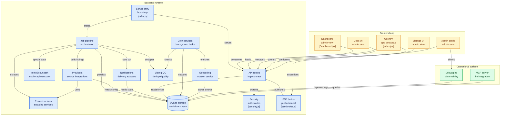

<p align="center">

<a href="https://fredy.orange-coding.net/">
<picture>
  <source media="(prefers-color-scheme: dark)" srcset="https://github.com/orangecoding/fredy/blob/master/doc/logo_white.png" width="400">
  <source media="(prefers-color-scheme: light)" srcset="https://github.com/orangecoding/fredy/blob/master/doc/logo.png" width="400">
  
</picture>
</a>
</p>

<p align="center">
  <a href="https://fredy.orange-coding.net/" target="_blank">Website</a>&nbsp;&nbsp;|&nbsp;&nbsp;
  <a href="https://fredy-demo.orange-coding.net/" target="_blank">Demo</a>&nbsp;&nbsp;|&nbsp;&nbsp;
  <a href="#-quick-start">Quick Start</a>&nbsp;&nbsp;|&nbsp;&nbsp;
  <a href="#-going-deeper">Docs</a>
</p>

<p align="center">
  
  
  
  
</p>

# Fredy 🏡 - Your Self-Hosted Real Estate Finder for Europe

**Fredy** watches **24 real estate portals** across 🇩🇪 🇦🇹 🇨🇭 🇪🇸 🇮🇹 🇵🇹 for you (e.g. Immoscout,
Kleinanzeigen etc), drops duplicates across platforms, and notifies you via **Slack, Telegram,
Email, ntfy, Discord and more** the moment a new listing appears. Searches are managed from a Web
UI, and you never see the same listing twice.

On top of the listing itself, Fredy answers the three questions a portal will not:

- **What would this cost me?** Enter your income, living costs and savings once, and every listing is
  measured against them, for renting and for buying. → [Financing](doc/financing.md)
- **How long would I actually travel?** Not straight-line distance, but the real journey from your
  own address by public transport, car, bike or on foot. → [Travel time](doc/travel-time.md)
- **Is this too good to be true?** Fredy reads every listing for the marks of a rental scam and warns
  you when enough of them line up. → [Scam detection](doc/scam-detection.md)

<p align="center">
  <a href="https://trendshift.io/repositories/43464?utm_source=trendshift-badge&amp;utm_medium=badge&amp;utm_campaign=badge-trendshift-43464" target="_blank" rel="noopener noreferrer"></a>
</p>

| Fredy Maps View                                  | Dashboard                                               | Found Listings                                                              |
|--------------------------------------------------|-----------------------------------------------------------------------|-----------------------------------------------------------------------------|
|  |  |  |

------------------------------------------------------------------------

## 🚀 Quick Start

### Docker (recommended)

``` bash
docker run -d --name fredy \
  -v fredy_conf:/conf \
  -v fredy_db:/db \
  -p 9998:9998 \
  ghcr.io/orangecoding/fredy:master
```

👉 Open <http://localhost:9998> and sign in with **`admin` / `admin`**.

> [!NOTE]
> No configuration file is needed to start. Fredy creates `/conf/config.json` on first run if it is
> missing. That file only holds the database path, everything else is configured in the Web UI and
> stored in the database. Documents you upload live in the database too, so the `/db` volume above
> is all you need to keep them, and every backup already contains them.

`:master` follows the master branch; pin a release with its version tag instead, e.g.
`ghcr.io/orangecoding/fredy:28.0.0`. Images are built for `linux/amd64` and `linux/arm64`. Logs:
`docker logs fredy -f`.

There is also a pre-release channel following the `develop` branch,
`ghcr.io/orangecoding/fredy-pre-release:latest`. It is built from the same pipeline (lint, format
check and the offline test suite all have to pass first), but the changes in it have not been through
master yet. Use it to try upcoming features or to verify a fix, not for an instance you rely on.

### Node.js

Requires **Node.js 22.22.0 or higher**.

``` bash
yarn
yarn run build:frontend  # builds the Web UI into ui/public
yarn run start:backend   # serves the UI and the API on port 9998
```

### Unraid

Fredy is in the [Unraid](https://unraid.net/) community store.

------------------------------------------------------------------------

## ✨ What you get

-   🏠 **24 portals** across 🇩🇪 🇦🇹 🇨🇭 🇪🇸 🇮🇹 🇵🇹: ImmoScout24, Immowelt, Kleinanzeigen, WG-Gesucht,
    willhaben, Flatfox, idealista, Subito and [16 more](doc/providers.md)
-   ⚡ **Instant notifications**: Slack, Telegram, Email (SMTP, SendGrid, Mailjet, Resend), ntfy,
    Discord, Mattermost, Pushover, Apprise and more
-   🔄 **Deduplication across platforms**: the same flat advertised on ImmoScout, Immowelt and
    Kleinanzeigen reaches you once, matched on living space, rooms and location rather than on the
    headline, no two portals write that the same way
-   🛑 **[Scam detection](doc/scam-detection.md)**: a warning on listings that read like rental fraud,
    with your verdict always outranking Fredy's
-   💶 **[Financing calculator](doc/financing.md)**: which listings you can afford, for renting and
    for buying
-   🚆 **[Real travel times](doc/travel-time.md)** from your addresses by public transport, car, bike
    or on foot, plus a filter to match, and the transport network with live departures on the map
-   📊 **Market benchmark**: the price per m² of every listing against the local median, so cheap and
    expensive are facts rather than a feeling
-   📎 **Document uploads**: attach the exposé, floor plans and photos to a listing, so they survive
    the portal taking the ad down. A listing with documents is never cleaned up automatically
-   🖥️ **Web UI** in several languages, with configurable search intervals and working hours
-   🤖 **[MCP server](lib/mcp/README.md)**: query your listings from Claude, ChatGPT or a local LLM
-   🌍 Runs anywhere: Docker, Node.js, self-hosted, and uses the reverse engineered
    **ImmoScout Mobile API**

------------------------------------------------------------------------

## 🧩 Basic architecture overview

| Concept | What it is |
|---|---|
| **Provider** 🌐 | A real-estate platform. You paste a search URL from the portal into Fredy, sorted by **date**. |
| **Adapter** 📡 | A *kind* of connection Fredy can send through (Slack, Telegram, Email, ntfy, Discord ...). You never configure one on its own. |
| **Channel** 🔔 | One filled-in adapter, e.g. "Telegram → family chat", saved once under **Settings → Notification channels** and reused in as many jobs as you like. |
| **Job** 📅 | Providers + channels: "search ImmoScout24 and Immowelt, send to Slack and Telegram". Runs at the interval set under **Administration → Execution**. |

A job can hold as many channels as you want, including several of the same type, and every new
listing goes out through all of them at once. Rotating a token means editing one channel instead of
every job that used it. Channels belong to whoever created them; an admin can share one with all
users or with admins only, which lets others *send* through it without ever revealing its
credentials. A channel still used by a job cannot be deleted.


``` mermaid
flowchart TD

subgraph group_backend["Backend runtime"]
  node_entry["Server entry<br/>bootstrap<br/>[index.js]"]
  node_pipeline["Job pipeline<br/>orchestrator"]
  node_providers["Providers<br/>source integrations"]
  node_extractor["Extraction stack<br/>scraping services"]
  node_immoscout["ImmoScout path<br/>mobile-api translator"]
  node_notifications["Notifications<br/>delivery adapters"]
  node_storage[("SQLite storage<br/>persistence layer")]
  node_api["API routes<br/>http contract"]
  node_security["Security<br/>authz/authn<br/>[security.js]"]
  node_sse["SSE broker<br/>push channel<br/>[sse-broker.js]"]
  node_crons["Cron services<br/>background tasks"]
  node_geocoding["Geocoding<br/>location service"]
  node_listingqc["Listing QC<br/>dedupe/quality"]
end

subgraph group_frontend["Frontend app"]
  node_uientry["UI entry<br/>app bootstrap<br/>[Index.jsx]"]
  node_dashboard["Dashboard<br/>admin view<br/>[Dashboard.jsx]"]
  node_jobsui["Jobs UI<br/>admin view"]
  node_listingsui["Listings UI<br/>admin view"]
  node_adminui["Admin config<br/>admin view"]
end

subgraph group_ops["Operational surface"]
  node_debug["Debugging<br/>observability"]
  node_mcp["MCP server<br/>llm integration"]
end

node_entry -->|"serves"| node_api
node_entry -->|"starts"| node_pipeline
node_pipeline -->|"pulls listings"| node_providers
node_pipeline -->|"scrapes"| node_extractor
node_pipeline -->|"special case"| node_immoscout
node_pipeline -->|"dedupes"| node_listingqc
node_pipeline -->|"persists"| node_storage
node_pipeline -->|"fans out"| node_notifications
node_providers -->|"uses"| node_extractor
node_providers -->|"reads config"| node_storage
node_notifications -->|"reads state"| node_storage
node_api -->|"protects"| node_security
node_api -->|"reads/writes"| node_storage
node_api -->|"publishes"| node_sse
node_crons -->|"enriches"| node_geocoding
node_crons -->|"checks"| node_listingqc
node_crons -->|"updates"| node_storage
node_geocoding -->|"stores coords"| node_storage
node_debug -->|"captures logs"| node_storage
node_mcp -->|"queries"| node_storage
node_uientry -->|"consumes"| node_api
node_uientry -->|"subscribes"| node_sse
node_dashboard -->|"loads"| node_api
node_jobsui -->|"manages"| node_api
node_listingsui -->|"queries"| node_api
node_adminui -->|"configures"| node_api
node_adminui -->|"shows"| node_debug

click node_entry "https://github.com/orangecoding/fredy/blob/master/index.js"
click node_pipeline "https://github.com/orangecoding/fredy/blob/master/lib/FredyPipelineExecutioner.js"
click node_providers "https://github.com/orangecoding/fredy/tree/master/lib/provider"
click node_extractor "https://github.com/orangecoding/fredy/tree/master/lib/services/extractor"
click node_immoscout "https://github.com/orangecoding/fredy/tree/master/lib/services/immoscout"
click node_notifications "https://github.com/orangecoding/fredy/tree/master/lib/notification/adapter"
click node_storage "https://github.com/orangecoding/fredy/tree/master/lib/services/storage"
click node_api "https://github.com/orangecoding/fredy/tree/master/lib/api/routes"
click node_security "https://github.com/orangecoding/fredy/blob/master/lib/api/security.js"
click node_sse "https://github.com/orangecoding/fredy/blob/master/lib/services/sse/sse-broker.js"
click node_crons "https://github.com/orangecoding/fredy/tree/master/lib/services/crons"
click node_geocoding "https://github.com/orangecoding/fredy/tree/master/lib/services/geocoding"
click node_listingqc "https://github.com/orangecoding/fredy/tree/master/lib/services/listings"
click node_debug "https://github.com/orangecoding/fredy/tree/master/lib/services/debug"
click node_mcp "https://github.com/orangecoding/fredy/tree/master/lib/mcp"
click node_uientry "https://github.com/orangecoding/fredy/blob/master/ui/src/Index.jsx"
click node_dashboard "https://github.com/orangecoding/fredy/blob/master/ui/src/views/dashboard/Dashboard.jsx"
click node_jobsui "https://github.com/orangecoding/fredy/tree/master/ui/src/views/jobs"
click node_listingsui "https://github.com/orangecoding/fredy/tree/master/ui/src/views/listings"
click node_adminui "https://github.com/orangecoding/fredy/tree/master/ui/src/views"

classDef toneNeutral fill:#f8fafc,stroke:#334155,stroke-width:1.5px,color:#0f172a
classDef toneBlue fill:#dbeafe,stroke:#2563eb,stroke-width:1.5px,color:#172554
classDef toneAmber fill:#fef3c7,stroke:#d97706,stroke-width:1.5px,color:#78350f
classDef toneMint fill:#dcfce7,stroke:#16a34a,stroke-width:1.5px,color:#14532d
classDef toneRose fill:#ffe4e6,stroke:#e11d48,stroke-width:1.5px,color:#881337
classDef toneIndigo fill:#e0e7ff,stroke:#4f46e5,stroke-width:1.5px,color:#312e81
classDef toneTeal fill:#ccfbf1,stroke:#0f766e,stroke-width:1.5px,color:#134e4a
class node_entry,node_pipeline,node_providers,node_extractor,node_immoscout,node_notifications,node_storage,node_api,node_security,node_sse,node_crons,node_geocoding,node_listingqc toneBlue
class node_uientry,node_dashboard,node_jobsui,node_listingsui,node_adminui toneAmber
class node_debug,node_mcp toneMint
```

------------------------------------------------------------------------

## 📚 Going deeper

| Topic | What is in there |
|---|---|
| [Providers & scraping](doc/providers.md) | All 24 providers, the Immoscout / idealista / Casa.it specifics, and residential proxies for when a VPS gets blocked |
| [Scam detection](doc/scam-detection.md) | The signals, their weights, the languages, and how to overrule Fredy |
| [Financing calculator](doc/financing.md) | Rent and Annuitätendarlehen, Kaufnebenkosten, Restschuld, the 35 % rule |
| [Travel time & public transport](doc/travel-time.md) | Addresses and place types, estimated vs exact, route drawing, departure boards, operator settings |
| [MCP server](lib/mcp/README.md) | Connecting Claude, ChatGPT or a local LLM to your listings |
| [Reverse proxy sign-in](doc/reverse-proxy-auth.md) | Forward auth with Authelia, Authentik, oauth2-proxy, Traefik, Pangolin |
| [Debug bundles](doc/debugging.md) | Capturing logs for a bug report |
| [Development](doc/development.md) | Dev mode, tests, fixtures, adding a language |
| [Contributing](CONTRIBUTING.md) | Writing a provider or a notification adapter |

### 🤖 MCP Server

Since **V20**, Fredy ships a built-in **MCP Server**, so you can connect it to Claude, ChatGPT or a
local model (LM Studio) and query your real estate data in natural language. A local LLM can even
enrich existing listings by checking them online. Setup: [MCP Readme](lib/mcp/README.md).

To connect Claude.ai or ChatGPT over OAuth, set Fredy's `baseUrl` to its public HTTPS URL and add
`<baseUrl>/api/mcp` as a custom MCP server. Fredy advertises OAuth discovery metadata, dynamically
registers the client, and asks you to sign in and approve read access. Access tokens expire after one
hour and refresh automatically; existing MCP tokens keep working for local clients. Connected apps
are listed under **Settings → Connections**, where access can be revoked at any time.

------------------------------------------------------------------------

## 📊 Analytics

Fredy is completely free (and will always remain free). However, it would be a huge help if you would
allow me to collect some analytical data. Before you freak out, let me explain: if you agree, Fredy
sends a ping every 6 hours to my internal tracking project (will be open sourced soon). The data
includes which notification adapters and providers are in use (the type only, for example `slack`,
never your channels, their names or their credentials), OS, architecture, Node version and language.
It is entirely anonymous and helps me understand which adapters and providers matter most.

**Thanks** 🤘

------------------------------------------------------------------------

## 🤝 Sponsorship

I build and maintain Fredy in my free time. If it saves you some, consider chipping in ❤️

<a href="https://ko-fi.com/orangecoding"></a> <a href="https://github.com/sponsors/orangecoding"></a>

Fredy is backed by the **JetBrains Open Source Support Program**.

<a href="https://www.jetbrains.com/community/opensource/">
<picture>
  <source media="(prefers-color-scheme: dark)" srcset="https://www.jetbrains.com/company/brand/img/logo_jb_dos_3.svg">
  <source media="(prefers-color-scheme: light)" srcset="https://resources.jetbrains.com/storage/products/company/brand/logos/jetbrains.svg">
  
</picture>
</a>

------------------------------------------------------------------------

## 👐 Contributing

Thanks to everyone who has contributed!

<a href="https://github.com/orangecoding/fredy/graphs/contributors"></a>

Start with the [Contributing Guide](CONTRIBUTING.md); it also covers
[where AI-assisted contributions help, and where they do not](CONTRIBUTING.md#-using-ai-such-as-claude-code).

------------------------------------------------------------------------

## 🗺️ Data Attribution & Partners

Timetables, journey planning and travel times come from [Transitous](https://transitous.org/), a
community-run [MOTIS](https://github.com/motis-project/motis) instance. It is free, needs no API key,
and is maintained by volunteers, so please be considerate with the load you put on it and read
[their usage policy](https://transitous.org/api/) before pointing a large instance at it. Street and
map data come from [OpenStreetMap](https://www.openstreetmap.org/copyright) contributors.

Every listing with coordinates links out to [Lagecheck](https://lagecheck.com/), which rates the
address on noise, air quality, green space and flood risk. Fredy only builds the link and stores
nothing from it; the underlying data is by [geosci.de](https://geosci.de/).

<a href="https://transitous.org/">
<picture>
  <source media="(prefers-color-scheme: dark)" srcset="https://transitous.org/images/logo-text.svg">
  <source media="(prefers-color-scheme: light)" srcset="https://transitous.org/images/logo-text-dark.svg">
  
</picture>
</a>

------------------------------------------------------------------------

## 📄 License

[Apache-2.0](LICENSE) with two additional conditions:

- **Commons Clause** - you may not sell the software, or sell a product or service whose value
  derives entirely or substantially from it. Self-hosting Fredy for yourself is explicitly fine.
- **Attribution and Naming Clause** - substantial derivative works must credit the original project
  "Fredy" and its author.

Because of these conditions Fredy is **source-available, not OSI open source**. Read the full
[LICENSE](LICENSE) before building anything commercial on top of it.

------------------------------------------------------------------------

## 💬 Support

- **Bugs and feature requests**: [GitHub Issues](https://github.com/orangecoding/fredy/issues). For
  bugs, attach a [debug bundle](doc/debugging.md).
- **An Immoscout search URL Fredy cannot map**: open an issue with the URL, it is usually a one line
  fix.
- **Try before you install**: the [live demo](https://fredy-demo.orange-coding.net/).

------------------------------------------------------------------------

## ⭐ Star History

<a href="https://github.com/orangecoding/fredy/stargazers">
  <picture>
    <source media="(prefers-color-scheme: dark)" srcset="doc/star-history/star-history-dark.svg">
    
  </picture>
</a>
