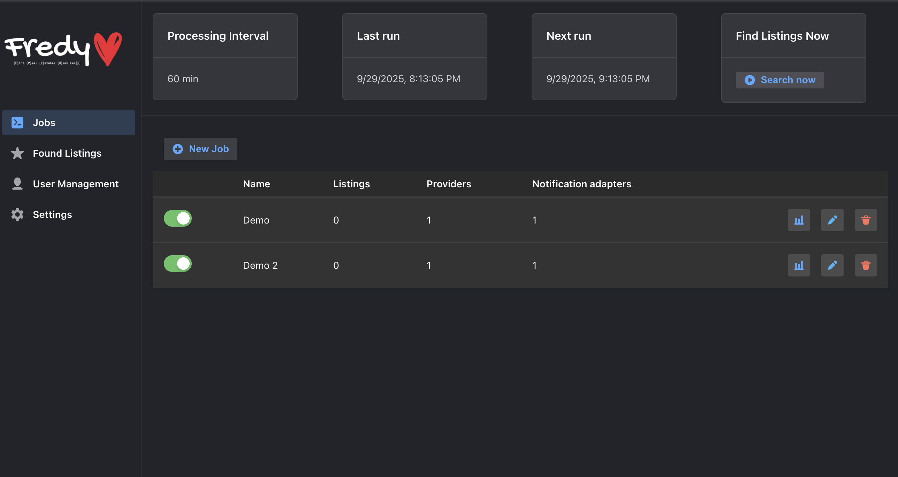

<p align="center">

<a href="https://fredy.orange-coding.net/">
<picture>
  <source media="(prefers-color-scheme: dark)" srcset="https://github.com/orangecoding/fredy/blob/master/doc/logo_white.png" width="400">
  <source media="(prefers-color-scheme: light)" srcset="https://github.com/orangecoding/fredy/blob/master/doc/logo.png" width="400">
  
</picture>
</a>
</p>


[](https://github.com/orangecoding/fredy/actions/workflows/docker.yml)


# Fredy 🏡 – Your Self-Hosted Real Estate Finder for Germany

Finding an apartment or house in Germany can be stressful and
time-consuming.\
**Fredy** makes it easier: it automatically scrapes **ImmoScout24,
Immowelt, Immonet, eBay Kleinanzeigen, and WG-Gesucht** and notifies you
instantly via **Slack, Telegram, Email, ntfy, and more** when new
listings appear.

With a modern architecture, Fredy provides a **clean Web UI**, removes
duplicates across platforms, and stores results so you never see the
same listing twice.


------------------------------------------------------------------------

## ✨ Key Features

-   🏠 Scrapes **ImmoScout24, Immowelt, Immonet, eBay Kleinanzeigen,
    WG-Gesucht**
-   ⚡ Instant notifications: Slack, Telegram, Email (SendGrid,
    Mailjet), ntfy
-   🔎 Uses the **ImmoScout Mobile API** (reverse engineered)
-   🌍 Runs anywhere: Docker, Node.js, self-hosted
-   🖥️ Intuitive **Web UI** to manage searches
-   🎯 Easy to use thanks to a user-friendly Web UI
-   🔄 Deduplication across platforms
-   ⏱️ Customizable search intervals

------------------------------------------------------------------------

## 🤠Sponsorship [](https://github.com/sponsors/orangecoding)

I maintain Fredy and other open-source projects in my free time.\
If you find it useful, consider supporting the project 💙

Fredy is proudly backed by the **JetBrains Open Source Support Program**.   

<picture>
  <source media="(prefers-color-scheme: dark)" srcset="https://www.jetbrains.com/company/brand/img/logo_jb_dos_3.svg">
  <source media="(prefers-color-scheme: light)" srcset="https://resources.jetbrains.com/storage/products/company/brand/logos/jetbrains.svg">
  
</picture>

------------------------------------------------------------------------

## 👨‍🏫 Demo
You can try out Fredy here: [Fredy Demo](https://fredy-demo.orange-coding.net/)

------------------------------------------------------------------------

## 🚀 Quick Start

### With Docker

> [!NOTE]
> In order to start Fredy, you must provide a config.json. As a start, use the one in this repo: https://github.com/orangecoding/fredy/blob/master/conf/config.json

``` bash
docker run -d --name fredy \
  -v fredy_conf:/conf \
  -v fredy_db:/db \
  -p 9998:9998 \
  ghcr.io/orangecoding/fredy:master
```

Logs:

``` bash
docker logs fredy -f
```

### Manual (Node.js)

-   Requirement: **Node.js 20 or higher**
-   Install dependencies and start:

``` bash
yarn
yarn run start:backend   # in one terminal
yarn run start:frontend  # in another terminal
```

👉 Open <http://localhost:9998>

**Default Login:**
- Username: `admin`
- Password: `admin`

------------------------------------------------------------------------

## 📸 Screenshots

| Job Configuration | Job Analytics | Job Overview |
|-------------------|--------------|--------------|
|  |  |  |

------------------------------------------------------------------------

## 🧩 Core Concepts

Fredy is built around three simple concepts:

### Provider 🌐

A **provider** is a real-estate platform (e.g. ImmoScout24, Immowelt,
Immonet, eBay Kleinanzeigen, WG-Gesucht).\
When you create a job, you paste the search URL from the platform into
Fredy.\
⚠️ Always make sure the search results are sorted by **date**, so Fredy
picks up the newest listings first.

### Adapter 📡

An **adapter** is the channel through which Fredy notifies you (Slack,
Telegram, Email, ntfy, ...).\
Each adapter has its own configuration (e.g. API keys, webhook URLs).\
You can use multiple adapters at once --- Fredy will send new listings
through all of them.

### Job 📅

A **job** combines providers and adapters.\
Example: "Search apartments on ImmoScout24 + Immowelt and send results
to Slack + Telegram."\
Jobs run automatically at the interval you configure (see
`/conf/config.json`).

------------------------------------------------------------------------

## Immoscout

Immoscout has implemented advanced bot detection. In order to work around this, we are using a reversed engineered version of their mobile api. See [Immoscout Reverse Engineering Documentation](https://github.com/orangecoding/fredy/blob/master/reverse-engineered-immoscout.md)

## Analytics

Fredy is completely free (and will always remain free). However, it would be a huge help if you’d allow me to collect some analytical data.
Before you freak out, let me explain...  
If you agree, Fredy will send a ping once every 6 hours to my internal tracking project (Will be open sourced soon).  
The data includes: names of active adapters/providers, OS, architecture, Node version, and language. The information is entirely anonymous and helps me understand which adapters/providers are most frequently used.</p>

**Thanks**🤘

## 🛠️ Development

### Development Mode

``` bash
yarn run start:backend:dev
yarn run start:frontend:dev
```
You should now be able to access _Fredy_ from your browser. Check your Terminal to see what port the frontend is running on.

### Run Tests

``` bash
yarn run test
```

------------------------------------------------------------------------

## 📐 Architecture


------------------------------------------------------------------------

## 👐 Contributing

Thanks to everyone who has contributed!

<a href="https://github.com/orangecoding/fredy/graphs/contributors"></a>

See the [Contributing
Guide](https://github.com/orangecoding/fredy/blob/master/CONTRIBUTING.md).

------------------------------------------------------------------------

## ⭐ Star History

[](https://www.star-history.com/#orangecoding/fredy&Date)
